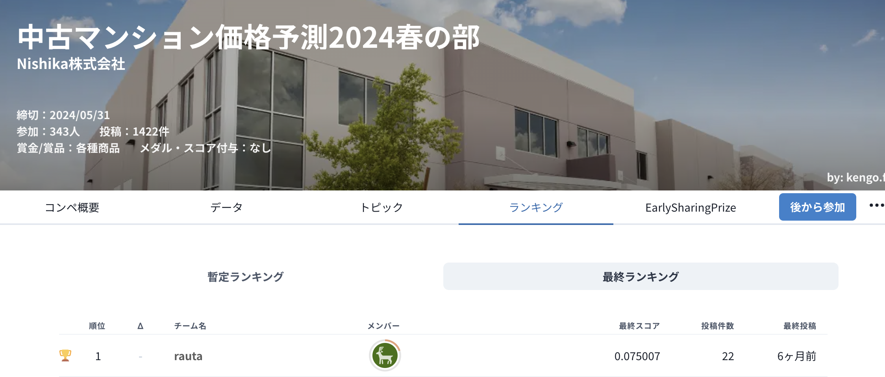

# Nishika Mansion2024spring 1st-Place Solution

2024年5月に開催されたNishikaで開催された「中古マンション価格予測 2024春の部」の優勝解法です。

- [コンペサイト](https://competition.nishika.com/competitions/mansion_2024spring/summary)

- [コンペ解法共有ページ](https://competition.nishika.com/competitions/mansion_2024spring/topics/718)

### 外部データについて
以下の外部データを使用しています。いずれも[[Nishika] 外部データ共有用トピック](https://competition.nishika.com/competitions/mansion_2024spring/topics/703)で共有されていたものです。
- 駅データ: https://ekidata.jp/doc/station.php
- 国土地理院API

### 解法概要図🎃

### 解法の主なポイント🚀
- できる限りシンプルなモデルを目指しました。上の図を見てもらっても分かる通り、非常にシンプルなアプローチです。データを観察すると欠損なども多く補完などの前処理の分析にほとんどの時間を割きました。
- 過去の解法では複数アルゴリズムでのモデルアンサンブルや2段階予測、後処理などが行われていますが、今回の解法では、データ前処理や特徴量エンジニアリングにフォーカスすることで、単平米価格予測での交差検証のみのアンサンブルで1位のスコアを達成しています。
- 経度緯度情報取得には、Geopyではなく国土地理院APIを使用。過去解法や本コンペなどではGeopyもよく経度緯度を取得するライブラリとして使われていましたが、いくつか目視確認していたところGeopyは精度が粗く感じました。国土地理院APIの方が正確な緯度経度が取得できました。
- 経度緯度情報を使った特徴量エンジニアリングを行う際は、Geohashを使用しました。これが特徴量エンジニアリングにおいては効果が大きかったです。Geohashを取得するには、geolibを使用しました。Geohashでエンコーディングした位置情報に対して、その枠の中に「レコードがどのくらいあるか」や「駅がどのくらいあるか」「駅から遠いか」などの特徴量を作成することで、栄えている地区や田舎、便利な地区などを表現することができたと思います。
- 予測のターゲットは、過去の解法でもよく行われているように、単平米価格を予測します。提出時には平米数をかけて価格に戻して提出します。
- 学習はLightGBMを使用し、目的関数をhuberに設定することもかなり効果の大きい項目でした。
- 学習処理自体は特に複雑なことはしていません。県名をキーにStratifiedKFoldで交差検証を行いました。5Foldの3シードアンサンブルの平均値で、1位のスコアを得ることができます。
- 上記のようにあまり複雑なことはしていませんので、まだまだスコアは上げれるという感触がありました。次回コンペなどの参加者の方の参考になれば幸いです。

### 解法もう少し具体的に🔥
#### 外部データ＆データ前処理
- 駅の緯度経度情報
    - こちらは駅データ.jpから取得しています。
    - 駅名と県名をキーに紐づけました
- 住所からの緯度経度情報
    - 国土地理院APIを使用して住所に紐づく経度緯度を取得しました。
- 住所緯度経度補完
    - 国土地理院APIで取得できなかった緯度経度で駅の緯度経度を持つものは、駅の緯度経度で補完しました。
- 地区名欠損補完
    - 地区名が欠損しているレコードを補完します。
    - 「県名」「駅名」「駅からの徒歩時間を10分単位で丸めたもの」をキーに欠損しているものを補完しました。
- 駅名欠損補完1 (最頻駅補完)
    - 駅名が欠損しているレコードを補完します。
    - 「住所」で最頻値の駅で補完
    - 元データの駅名は()で県表示がされているものもあるので(以下を除外
- 駅名欠損補完2 (最近傍駅補完)
    - 駅名欠損補完1でも補完できなかったレコードを補完します。
    - 住所緯度経度から一番近い距離の駅を探して補完します。
    - 緯度経度からの距離の算出には、Geopyのgeodesic関数を使用しました。
#### 特徴量エンジニアリング
主に新規作成した特徴量は以下です。
- 駅からの距離: Geopyのgeodesic関数を使用
- ジオハッシュ: 精度2~7のエンコーディングを行なって位置メッシュを取得
- 集計特徴量
    - 「県」「市」「建築年」「ジオハッシュ」などのCountEncoding
    - 「県」「市」「ジオハッシュ」グループごとの駅数や路線数
    - 「県」「市」「ジオハッシュ」グループごとの駅徒歩時間平均値や建築年平均値など
#### 学習
- ターゲット変数は、元の目的変数である価格を平米数で割った単平米価格
- アルゴリズムはLightGBM
- objective: huber
- 県名でのStratifiedKFoldで、5Fold x 3シードアンサンブル
- 他は特に複雑な処理はなし。一般的な学習処理のみ。
#### 予測
- こちらも特に複雑な処理はなし
- 単平米価格を予測しているので、最終的には平米数をかけて価格を算出
